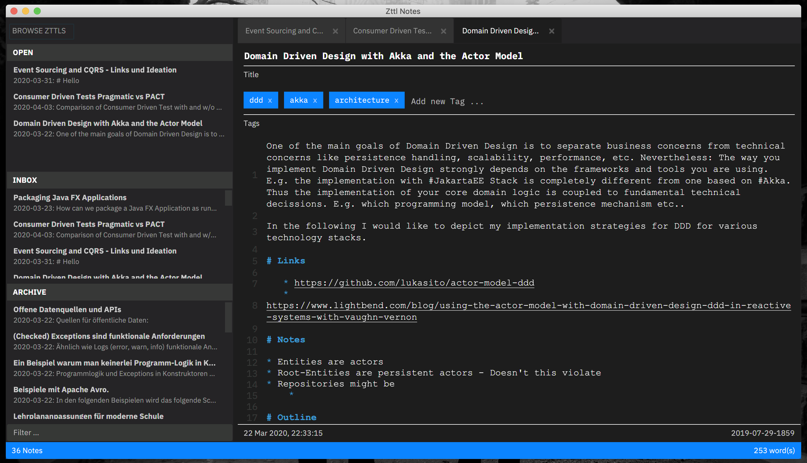

# Zettels 

Zettels is a note taking application written with JavaFX. It follows the principles [Niklas Luhman's Zettelkasten](https://de.wikipedia.org/wiki/Zettelkasten) - A slip-box/ file-card system to organize (scientific) notes. Notes can be written with Markdown. The editor also stores them as plain Markdown in the local file system.

The application is under active development and is used by early adaptors.

